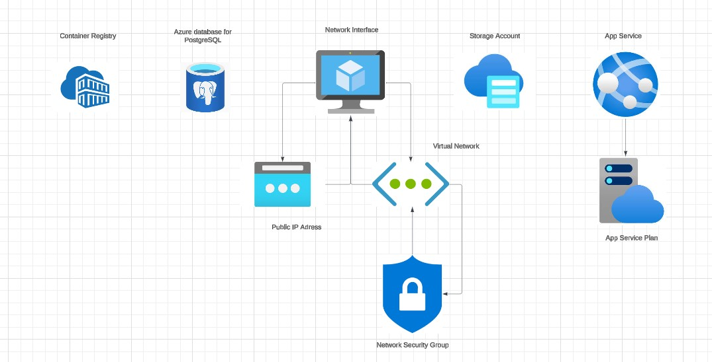

## 👨‍💻 **Members**

| **Name**                | **Specialty**      |
|-------------------------|--------------------|
| **Anas BELHAMRA**       | BIG DATA          |
| **Adam NAJIB**          | BIG DATA          |
| **Adnane MARBOUH**      | BIG DATA          |
| **Souhail KHALMADANI**  | BIG DATA          |
| **Hatim FAQDAOUI**      | BIG DATA          |

---

# 📘 **Shop App API on Azure Cloud**

This project demonstrates a simple **Flask** application deployed on **Azure** using **Terraform**. The app serves as the backend for an e-commerce platform with features like user authentication, product management, and order processing. 

---

## 📋 **Project Structure**

- **api/**: Contains the Flask application code, including routes, models, and controllers.
- **infrastructure/**: Contains the **Terraform** code to provision the Azure infrastructure.
- **.github/**: Contains **GitHub Actions** workflows for **CI/CD**.

## 🚀 **Getting Started**

### 🛠 **Prerequisites**
- Python 3.10.2
- Terraform 1.5 or later
- Azure account

### 🏃‍♂️ **Running the Application Locally**
1. Install dependencies:
   
bash
   pip install -r api/requirements.txt
2. Run the app
bash
   python api/app.py
### 🧪 **Running the Tests Locally**
1. Install pytest
    
bash 
    pip install pytest
2. Run tests using pytest
bash
    pytest api/tests

## 🧑‍💻 **Flask Application**

### 📜 **Overview**

The **Flask-based** application serves as the core API for the e-commerce platform. It handles user authentication, product management, shopping cart functionality, and order processing.

### 🔑 **Key Features**

- **User Authentication**: Customers can sign up, log in, and reset their passwords using **Flask-Login**.
- **Product Management**: Allows customers to search for products and add them to their shopping cart.
- **Admin Controls**: Admin users can manage product stock levels and update order statuses.
- **Forms**: **Flask-WTF** is used for secure and easy handling of forms, including login, registration, and product management forms.

### 📌 **Features List**

- 📌 Customers can sign in or sign up
- 📌 Customers can reset their passwords
- 📌 Customers can search for products
- 📌 Customers can add items to their cart
- 📌 Admins can manage product stock levels
- 📌 Admins can update order statuses

### ⚙️ **How it Works**

The app follows the **Model-View-Controller (MVC)** architecture:

- **Model**: Uses **SQLAlchemy** for database interactions, defining models for entities like users, products, orders, etc. SQLAlchemy ensures that the app communicates efficiently with the database to store and retrieve data.
  
- **View**: Since this is an API-based application, the "view" is primarily the **JSON responses** returned by various API endpoints. The views are rendered dynamically by the **Flask** route handlers, which generate and send JSON objects in response to HTTP requests.

- **Controller**: The **routes** defined in app.py handle the business logic of each API endpoint. These routes control how the application interacts with the user, such as handling login, product search, adding items to a cart, and processing orders.

### 📂 **Application Flow**

1. **User Authentication**:
   - **Sign up**: Users can create a new account.
   - **Login**: Existing users can log in using their credentials.
   - **Password Reset**: Users can reset their passwords using email verification.

2. **Product Management**:
   - Customers can view available products, search for specific items, and add them to their shopping cart.
   - Admin users have the ability to update product stock levels and manage product details.

3. **Order Processing**:
   - Users can place orders, and admins can update the order status (e.g., processing, shipped).

4. **Form Handling**:
   - Forms, such as the login form and product management form, are managed using **Flask-WTF**, ensuring secure and easy handling of user input.

### 🔧 **Flask Extensions Used**

- **Flask-Login**: Manages user sessions and authentication.
- **Flask-SQLAlchemy**: Facilitates database operations, allowing interaction with the app's models.
- **Flask-WTF**: Simplifies form handling and ensures secure data validation.
- **Flask**: The lightweight framework used to build the API.

# 🌐 **Infrastructure Setup**

The infrastructure for the **Shop App** is provisioned using **Terraform** on **Azure Cloud**. Below are the modules and configurations used for the deployment.

⚙️ **Terraform Modules**
- **App Service**: Provisions the Azure App Service and Container Registry to host the Flask application and its Docker containers.
- **Database**: Sets up the PostgreSQL server and database for data storage.
- **Network**: Configures the virtual network, subnets, and security groups to ensure secure communication.
- **Storage**: Creates the Azure Storage Account, container, and blob storage for application assets and files.
- **Subnet**: Defines the subnet within the virtual network where resources like the App Service, Database, and other private services are placed. This subnet ensures network isolation for resources requiring secure communication, with the ability to configure private endpoints.

---

🛠 **Provider Configuration**
- **Azure Provider**: Configured with the necessary subscription ID and features to interact with the Azure platform.

---

🏗 **Resource Group**
- **Resource Group**: Defines the resource group that contains all resources in Azure, ensuring proper management and billing.

---

## 📊 **Infrastructure Diagram**

Below is the visual representation of the Azure infrastructure for the **Shop App API**, showcasing the interconnected resources:

## 🚀 Infrastructure Diagram Overview

This diagram represents an **Azure cloud-based solution** with the following components:

| **Component**                     | **Description**                                       |
|-----------------------------------|-------------------------------------------------------|
| **Container Registry**            | Stores and manages container images.                  |
| **Azure Database for PostgreSQL** | Fully managed relational database service.            |
| **Network Interface**             | Connects virtual machines to the Virtual Network.     |
| **Storage Account**               | Provides scalable storage for blobs, files, and disks.|
| **Public IP Address**             | Enables external access to resources.                 |
| **Virtual Network (VNet)**        | Ensures secure communication between resources.       |
| **Network Security Group**        | Controls inbound and outbound traffic.                |
| **App Service**                   | Hosts web applications and APIs.                      |
| **App Service Plan**              | Defines compute resources for the App Service.        |

---

📤 **Outputs**

After running the Terraform scripts, the following outputs are generated for easy reference:
- **ACR Login Server**: The URL for the Azure Container Registry where the application containers are stored.
- **SQL Server FQDN**: Fully qualified domain name of the SQL Server instance.
- **Database Name**: The name of the SQL database created in Azure.
- **Storage Account Name**: The name of the Azure Storage Account provisioned for storing application data and assets.
- **Subnet Information**: Details of the subnet where the resources are deployed, including its address range, and any private endpoints that are assigned within the subnet.